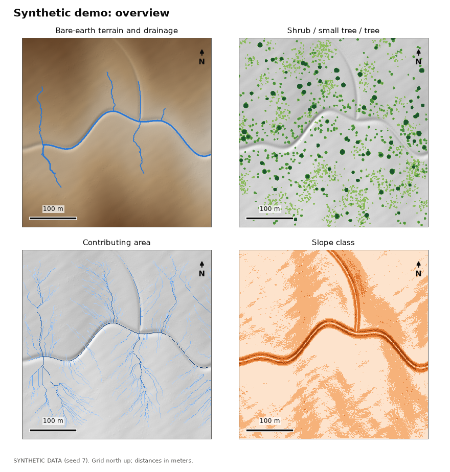
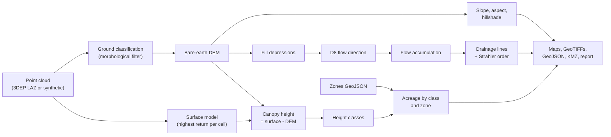

# lidar_terrain_lab

Turn an airborne LiDAR point cloud into bare-earth terrain, canopy height, drainage lines and vegetation-height acreage, with every stage tested against a synthetic scene whose answers are known.

[](https://github.com/maxskrehbiel/lidar_terrain_lab/actions/workflows/ci.yml)  

## Overview

Two land-management questions come up again and again: how much of an area is being taken over by brush and young trees (and so how many acres a treatment would cover), and where water goes when it rains. Airborne LiDAR answers both, because each laser return records the height of whatever it hit, from bare ground to treetops. This package reads a LiDAR point cloud, such as a public USGS 3DEP tile, separates ground returns from vegetation, builds a bare-earth elevation model and a canopy height model, routes surface water to find drainage lines, and classes vegetation by height to report acreage by class and by user-supplied zone. It writes map images, a GeoTIFF bundle, GeoJSON, a KMZ for Google Earth and a short report. The demo runs offline on a seeded synthetic landscape and scores each product against the truth it was generated from.



## Architecture



1. Read LAS/LAZ tiles, crop them to a study box and drop points the provider flagged as noise.
2. Label ground returns, using the provider's ground class or re-deriving it.
3. Rasterize a bare-earth DEM, a surface model and the canopy height model on one 1 m grid.
4. Derive slope, aspect and shaded relief from the DEM.
5. Fill depressions, route flow, accumulate it and extract drainage lines.
6. Class canopy heights and total the acreage by class and by zone.
7. Write PNG maps, a GeoTIFF bundle, GeoJSON, a KMZ, a Markdown and HTML report, and a JSON summary.

## Quickstart

```bash
git clone https://github.com/maxskrehbiel/lidar_terrain_lab.git
cd lidar_terrain_lab
python -m venv .venv
source .venv/bin/activate          # Windows: .venv\Scripts\activate
pip install -e ".[dev]"
lidar_terrain_lab demo
```

The demo needs no network access and writes to `demo_output/`: six map plates, `report.md` and `report.html`, `summary.json`, GeoJSON in `vectors/`, `google_earth.kmz`, and a GeoTIFF bundle in `geotiff/`. It prints each truth check and exits with 1 if any fails. The committed [`examples/`](examples/report.md) folder is the same demo, regenerated with `lidar_terrain_lab demo --out examples` (GeoTIFFs are not committed).

## Usage

### Command line

```text
lidar_terrain_lab demo  [--out DIR] [--seed N] [--size-m M] [--no-geotiff]
lidar_terrain_lab fetch [--config TOML] [--dest DIR] [--list-only] [--yes]
lidar_terrain_lab run   (--laz FILE [FILE ...] | --fetch) [--config TOML] [--zones GEOJSON]
                        [--out DIR] [--ground auto|existing|pmf] [--crs EPSG:XXXX]
                        [--z-units auto|m|ft|us-ft] [--no-region-crop] [--no-geotiff]
                        [--dest DIR] [--yes]
```

`python -m lidar_terrain_lab ...` works the same way. Add `-v` for progress messages or `-vv` for debug detail; by default only warnings are shown. `run --laz` needs no config file and uses the built-in settings unless `--config` is given. `fetch` and `run --fetch` use the packaged example region unless `--config` names another.

| Exit code | Meaning |
|---|---|
| 0 | Success. |
| 1 | A demo truth check failed. |
| 2 | Usage, configuration or input error: a bad argument, an unreadable config, a missing or unusable LAZ or GeoJSON file, or a failed download. |
| 3 | A required optional dependency is missing (laspy, for LAS/LAZ files). |

Handled errors print one line to stderr, without a traceback.

### Running on public USGS 3DEP data

```bash
pip install -e ".[lidar]"                       # adds laspy with the LAZ decoder
lidar_terrain_lab fetch --list-only             # tiles covering the packaged example region
lidar_terrain_lab run --fetch                   # download to data/raw/, then process
lidar_terrain_lab run --laz data/raw/*.laz --zones my_zones.geojson --out outputs/my_area
```

`fetch` queries The National Map (TNM) Access API for "Lidar Point Cloud (LPC)" products that intersect the configured box. It keeps one 3DEP project (the most recent one that covers the whole box) and downloads its LAZ tiles over HTTPS, refusing any URL, including a redirect target, outside the USGS download hosts. Downloads over 1 GB need `--yes`. At the time of writing the example region resolves to four tiles of about 94 MB in total. Downloads land in `data/raw/` and outputs in `outputs/`; both are git-ignored.

A config file holds the study box and any pipeline settings to override. The packaged example lives at `src/lidar_terrain_lab/data/demo_region.toml`; copy it, change `[region]`, and pass the copy with `--config`:

```toml
[region]
name = "Wichita Mountains NWR sample area"
land_status = "Federal public land: U.S. Fish and Wildlife Service national wildlife refuge."
bbox_wgs84 = [-98.6841, 34.7466, -98.6775, 34.7520]  # west, south, east, north

[pipeline.hydrology]
channel_threshold_ha = 1.0

[pipeline.vegetation]
breaks_m = [0.5, 2.0, 5.0]
names = ["Open", "Shrub", "Small tree", "Tree"]
woody = ["Shrub", "Small tree", "Tree"]
treatment = ["Shrub", "Small tree"]
```

Zones are ordinary GeoJSON polygons in longitude/latitude with a `name` property; any polygon layer exported from QGIS will do.

### Python API

```python
from lidar_terrain_lab.config import PipelineParams
from lidar_terrain_lab.pipeline import run_pipeline
from lidar_terrain_lab.synthetic import make_scene
from lidar_terrain_lab.validation import validate

scene = make_scene(seed=7)
products = run_pipeline(scene.cloud, PipelineParams(), scene.zones, grid=scene.grid)

for area in products.class_table:
    print(f"{area.name:<11} {area.acres:6.2f} ac")
print("treatment:", round(products.stats.treatment_acres, 2), "ac")
print("all truth checks pass:", all(check.passed for check in validate(products, scene)))
```

For real tiles, `lidar_terrain_lab.point_cloud.read_las(paths, bbox_wgs84=...)` returns the same `PointCloud` type the synthetic generator does, and `lidar_terrain_lab.workflows.run_on_tiles` wraps reading, processing and writing every output.

## How it works

### Point cloud

A LiDAR survey fires laser pulses from an aircraft and records where each reflection (a *return*) came from as an (x, y, z) point, typically several per square meter. Providers tag each point with an ASPRS class code: 1 unclassified, 2 ground, 7 and 18 noise, and so on. Noise points are dropped before anything else.

### Ground classification

3DEP deliveries already mark ground points, and `auto` mode uses that class when at least 5% of points carry it. Otherwise the progressive morphological filter (Zhang et al., 2003) derives it. It starts from the lowest point in each 1 m cell. A *morphological opening* with a window of `w` cells (a moving minimum followed by a moving maximum) removes anything narrower than the window that sticks up, such as a shrub, while leaving broad ground in place. The filter repeats with windows of 3, 5, 9 and 17 cells, and a cell is marked non-ground when an opening lowers it by more than a threshold that grows with the window, so a hillside is not mistaken for a tree:

```
threshold_k = min(h0 + s * (w_k - w_(k-1)) * cell_size, h_max)
```

Here `s` is the steepest terrain slope expected (rise over run), `h0` = 0.3 m and `h_max` = 3 m. Points within 0.25 m of the surviving ground surface are ground.

### Bare-earth DEM

A DEM (digital elevation model) is a grid of ground elevations: the land surface with vegetation removed. Each cell is the mean height of the ground returns inside it. Cells without any (under dense crowns, over water) are filled by repeatedly replacing each empty cell with the average of its four neighbors until nothing changes, which gives the smoothest surface consistent with the known cells.

### Surface model and canopy height

The surface model (DSM) is the highest vegetation-eligible return in each cell; noise, buildings, water and bridge decks are excluded. The canopy height model (CHM) is the height of whatever stands on the ground:

```
CHM = DSM - DEM
```

Negative values become 0, implausible spikes above 45 m take the local median, and pits (cells more than 1.5 m below their 3 x 3 median, where every return slipped between branches) are filled with the median.

### Slope, aspect and hillshade

For each cell, Horn's (1981) method weighs the eight neighbors to estimate the elevation change per meter eastward (`p`) and northward (`q`). Slope is the steepness, aspect the compass direction the slope faces, and hillshade the brightness under a low sun (by default from the north-west, 45 degrees up):

```
slope     = atan(sqrt(p^2 + q^2))
aspect    = atan2(-p, -q)            (degrees clockwise from north, downhill)
hillshade = cos(zenith) cos(slope) + sin(zenith) sin(slope) cos(sun_azimuth - aspect)
```

### Depression filling

Small pits in a DEM, real or artifacts, would trap simulated water. Priority-Flood+epsilon (Barnes, Lehman and Mulla, 2014) works inward from the grid edges, always expanding from the lowest cell reached so far with a priority queue. Any newly reached cell that is lower than its neighbor is inside a pit, so it is raised to just above that neighbor (the next representable number). Afterwards every cell has a downhill path to an edge. The amount each cell was raised is saved as `sink_depth`.

### Flow direction and accumulation

D8 routing (O'Callaghan and Mark, 1984) sends each cell's water to whichever of its eight neighbors is steepest downhill, with the drop divided by the distance (1 cell, or 1.41 cells diagonally). Codes follow the common ESRI convention (1 = east, 2 = south-east, ... 128 = north-east). Border cells drain off the grid, because a tile is a window on a larger landscape and routing along its edge would draw false channels.

Flow accumulation is the number of cells, and so the area, that drains through each cell, including itself. It is computed in waves: first all cells nothing flows into (ridges), then any cell whose upstream neighbors are all done. Each wave is one vectorized NumPy step.

### Drainage lines

A cell is part of a drainage line when its contributing area exceeds a threshold (1 ha by default). Lines are traced from their heads to junctions and outlets and given a Strahler (1957) order: headwater reaches are order 1, and where two reaches of order n meet the result is order n + 1.

### Vegetation classes and acreage

Each cell is classed by canopy height:

| Class | Height | Meaning in the field | Woody | Treatment |
|---|---|---|---|---|
| Open | < 0.5 m | grass, forbs, bare ground | no | no |
| Shrub | 0.5 to 2 m | brush and seedlings | yes | yes |
| Small tree | 2 to 5 m | young trees | yes | yes |
| Tree | > 5 m | established trees | yes | no |

Area is `cells x cell area / 4,046.86 m2 per acre`. Woody cover sums the classes flagged woody, and treatment acreage sums the classes flagged for treatment (by default Shrub and Small tree: young woody plants, which are usually the cheapest to treat). Breaks, names and both flags are configurable.

### Zones

A cell belongs to a zone when its center falls inside the zone polygon. Each zone gets acreage by class, woody and treatment acreage, and mean slope.

### Outputs

| File | Contents |
|---|---|
| `maps/*.png` | overview, terrain, canopy height, vegetation classes, drainage, slope |
| `geotiff/*.tif` | dem, dsm, chm, slope, aspect, hillshade, sink_depth, flow_direction, flow_accumulation, stream_order, veg_class, zones |
| `vectors/drainage_lines.geojson` | reaches with Strahler order, length and contributing area |
| `vectors/zones_summary.geojson` | zones with acreage by class |
| `google_earth.kmz` | ground overlays (relief, classes, canopy, flow, slope), drainage lines, zones, legend |
| `report.md`, `report.html`, `summary.json` | the numbers above in readable and machine-readable form |

Map plates show distances from the south-west corner instead of coordinates. Text outputs carry no timestamps and use `\n` line endings, and PNG and KMZ files carry no software tags or file times, so re-running the demo reproduces them byte for byte on the same platform.

### Validation against synthetic truth

`synthetic.py` builds a landscape from formulas, so the true value of everything is known: a meandering incised channel in a tilted valley, a curved tributary, rolling uplands made from random plane waves, and about 2,000 dome-shaped crowns (shrub patches, small trees crowding the channel banks, scattered trees). It then samples returns the way a sensor would: ground points that mostly fail to penetrate crowns, returns on and inside crowns, and a few flagged noise points, all left unclassified. `validation.py` scores the pipeline on 13 checks: ground-label accuracy, DEM error in the open and under crowns, crown-top height, the area of each woody class, and how closely the drainage line follows the true channel. The tests require every check to pass on five seeds, with scenes from 80 m to 160 m across.

## Project layout

```text
lidar_terrain_lab/
├── .github/
│   └── workflows/
│       └── ci.yml                   lint, format, type check, tests, demo and reproducibility
├── examples/                        committed demo output (synthetic only)
├── src/
│   └── lidar_terrain_lab/
│       ├── __init__.py
│       ├── __main__.py
│       ├── cli.py                   demo, fetch and run subcommands
│       ├── workflows.py             end-to-end runs and output writing
│       ├── config.py                frozen settings dataclasses, TOML loading
│       ├── data/
│       │   └── demo_region.toml     example public study box (package data)
│       ├── errors.py                exception types
│       ├── point_cloud.py           PointCloud, LAS/LAZ reading and writing, CRS parsing
│       ├── fetch.py                 3DEP tile search, selection and download
│       ├── synthetic.py             seeded synthetic scene with known truth
│       ├── rasterize.py             Grid, point binning, void filling
│       ├── ground.py                progressive morphological filter, DEM
│       ├── canopy.py                surface model, canopy height model
│       ├── terrain.py               slope, aspect, hillshade
│       ├── hydrology.py             Priority-Flood, D8, accumulation, drainage network
│       ├── classify.py              height classes and acreage
│       ├── zones.py                 zone polygons, rasterization, per-zone tables
│       ├── export.py                GeoTIFF and GeoJSON
│       ├── kmz.py                   Google Earth KMZ
│       ├── maps.py                  PNG map plates
│       ├── styles.py                shared colors, ramps and PNG settings
│       ├── report.py                summary JSON, Markdown and HTML report
│       ├── validation.py            truth checks for synthetic scenes
│       └── _types.py                NumPy array type aliases
├── tests/                           unit, end-to-end and integration tests
├── .editorconfig
├── .gitattributes
├── .gitignore
├── LICENSE
├── README.md
└── pyproject.toml
```

## Development

```bash
pip install -e ".[dev]"
ruff check .
ruff format --check .
mypy src
pytest --cov=lidar_terrain_lab --cov-report=term-missing
lidar_terrain_lab demo --out examples      # regenerate the committed examples
pytest -m integration                      # optional: live query of the USGS TNM API
```

Every module except `__init__`, `__main__`, `_types` and `errors` has a matching `tests/test_<module>.py`. The tests are offline and seeded, and assert recovered values against known synthetic truth. The `integration` marker, deselected by default, checks that the example region still resolves to 3DEP tiles that cover it. CI regenerates `examples/` and fails if any committed text file changes.

## Data

All files in `examples/` and all test data come from `synthetic.py` with a fixed seed. The scene is georeferenced beside 0 N, 0 E, in open ocean in the Gulf of Guinea (the usual "Null Island" placeholder), so it cannot be mistaken for real land.

Real point clouds come from the U.S. Geological Survey 3D Elevation Program (3DEP) through The National Map Access API. They are downloaded at run time and never committed. USGS-authored data are in the public domain; credit: U.S. Geological Survey, 3D Elevation Program. The example region in `demo_region.toml` is a box of about 600 m by 600 m, roughly 3.5 km inside the Wichita Mountains National Wildlife Refuge in Oklahoma, federal land managed by the U.S. Fish and Wildlife Service. No results for that area are included in this repository.

`.gitignore` excludes LAS/LAZ and GeoTIFF files, `data/`, `outputs/` and `demo_output/`.

## Limitations

Height is not species. A 3 m juniper and a 3 m oak look the same to LiDAR, so class acreage is a screening figure for planning and field checks, not a species map or a treatment prescription.

The surface model takes the highest return per cell, so a crown that covers part of a cell can claim the whole cell, while sparse returns on a thin crown edge can miss it. On the synthetic scenes, woody-class areas come out within about 10% of an ideal raster at the same resolution, usually slightly low.

The morphological filter assumes a maximum terrain slope; cliffs, boulders and steep rock can be misclassified. `auto` mode prefers the provider's ground class for this reason.

Hydrology is surface-only and single-direction. D8 sends all water to one neighbor, flats inside filled depressions drain along nearly parallel lines, and culverts, road crossings and bridges are not modeled, so embankments can block drainage lines that pass under them in reality. The channel threshold controls how dense the network looks, and catchments are cut off at the study-box edges.

Depression filling is a pure-Python priority queue: fine for a few million cells, slow for county-sized areas without tiling.

Points stay in the tile's projected CRS, and all tiles in one run must share it. Heights follow the horizontal units unless `--z-units` says otherwise.

Tile listing is exercised by an integration test and LAS/LAZ reading by round-trip tests on synthetic files; processing real 3DEP tiles end to end is not part of CI.

## References

- Barnes, R., Lehman, C., and Mulla, D. (2014). Priority-flood: An optimal depression-filling and watershed-labeling algorithm for digital elevation models. *Computers & Geosciences*, 62, 117-127. https://doi.org/10.1016/j.cageo.2013.04.024
- Horn, B. K. P. (1981). Hill shading and the reflectance map. *Proceedings of the IEEE*, 69(1), 14-47. https://doi.org/10.1109/PROC.1981.11918
- O'Callaghan, J. F., and Mark, D. M. (1984). The extraction of drainage networks from digital elevation data. *Computer Vision, Graphics, and Image Processing*, 28(3), 323-344. https://doi.org/10.1016/S0734-189X(84)80011-0
- Strahler, A. N. (1957). Quantitative analysis of watershed geomorphology. *Transactions, American Geophysical Union*, 38(6), 913-920. https://doi.org/10.1029/TR038i006p00913
- Zhang, K., Chen, S.-C., Whitman, D., Shyu, M.-L., Yan, J., and Zhang, C. (2003). A progressive morphological filter for removing nonground measurements from airborne LIDAR data. *IEEE Transactions on Geoscience and Remote Sensing*, 41(4), 872-882. https://doi.org/10.1109/TGRS.2003.810682

## License

MIT © Maxwell Krehbiel. See [LICENSE](LICENSE).
