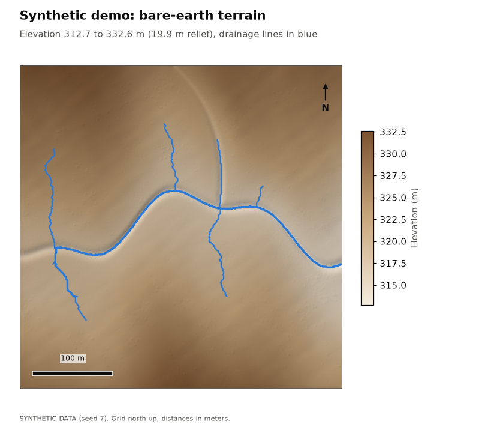
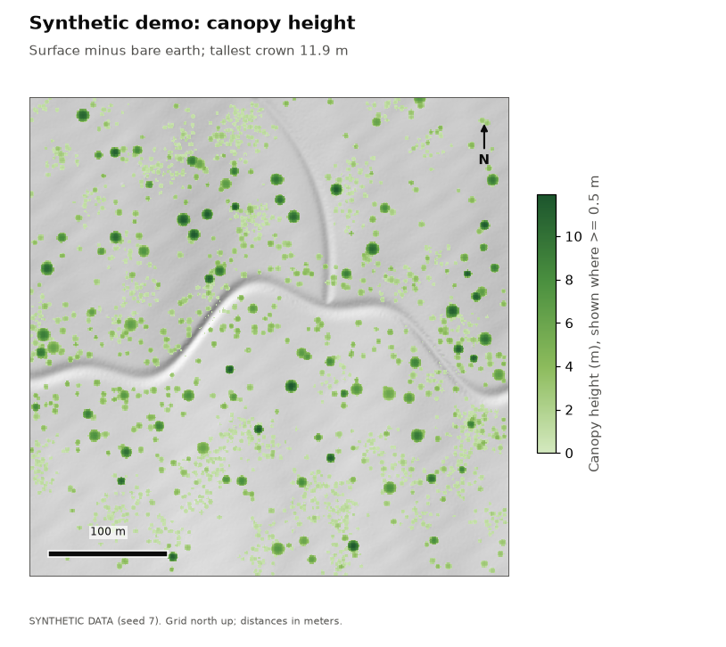
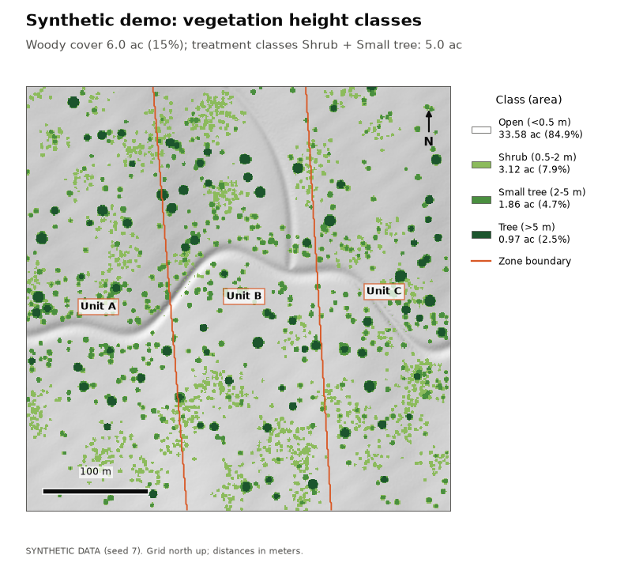
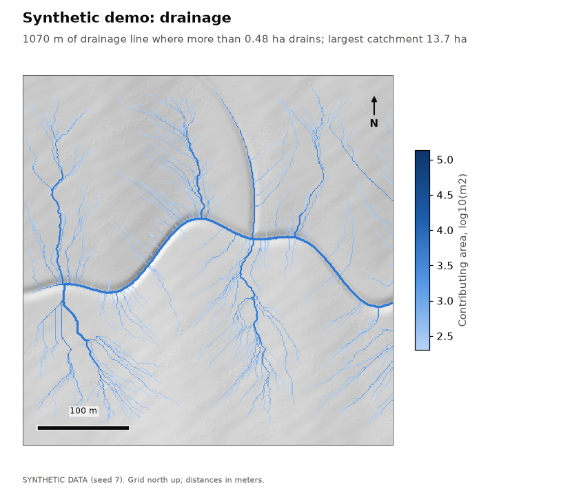
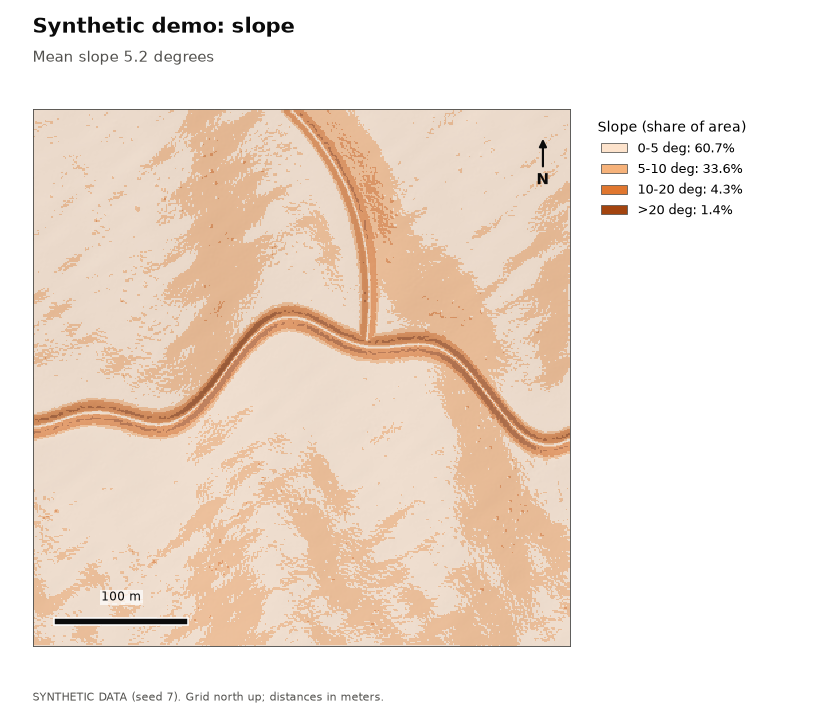

# Synthetic demo

> **Data: SYNTHETIC.** Generated point cloud (seed 7): a 400 m x 400 m scene with rolling terrain, a meandering channel, a tributary, and scattered shrubs and trees. Not a real place: the scene is georeferenced beside 0 N, 0 E, in open ocean, so it cannot be confused with real land.

## Key numbers

| Measure | Value |
|---|---|
| Area analyzed | 39.5 ac (16.00 ha) |
| Cell size | 1 m |
| Points (noise removed) | 1,097,372 |
| Point density | 6.9 per m2 |
| Ground method | pmf |
| DEM cells interpolated | 1.3% |
| Elevation range | 312.7 to 332.6 m |
| Mean slope | 5.2 deg |
| Woody cover | 5.95 ac (15.1%) |
| Treatment acreage (Shrub + Small tree) | 4.98 ac |
| Drainage line length | 1070 m in 15 reaches |
| Largest contributing area | 13.65 ha |
| Filled depressions deeper than 0.1 m | 0.16 ac |

## Vegetation height classes

Each cell is classed by the height of whatever stands on it (canopy height = surface minus bare earth). Treatment acreage sums the classes configured as treatment targets.

| Class | Acres | Hectares | Share |
|---|---|---|---|
| Open (<0.5 m) | 33.58 | 13.59 | 84.9% |
| Shrub (0.5-2 m) | 3.12 | 1.26 | 7.9% |
| Small tree (2-5 m) | 1.86 | 0.75 | 4.7% |
| Tree (>5 m) | 0.97 | 0.39 | 2.5% |

## By zone

Cells are assigned to a zone by their center.

| Zone | Total ac | Open ac | Shrub ac | Small tree ac | Tree ac | Treatment ac | Mean slope |
|---|---|---|---|---|---|---|---|
| Unit A | 13.44 | 11.51 | 0.98 | 0.66 | 0.29 | 1.64 | 4.4 deg |
| Unit B | 13.84 | 11.59 | 1.22 | 0.63 | 0.39 | 1.85 | 5.7 deg |
| Unit C | 12.26 | 10.48 | 0.91 | 0.57 | 0.29 | 1.48 | 5.3 deg |

## Terrain

Share of area by slope class: 0-5 deg: 60.7%, 5-10 deg: 33.6%, 10-20 deg: 4.3%, >20 deg: 1.4%.

## Drainage

Drainage lines are drawn where more than 0.48 ha drains through a cell. Highest Strahler order: 2. Deepest filled depression: 0.34 m.

## Validation against synthetic truth

The synthetic scene's true ground, crowns and channel are known, so each product can be scored.

| Check | Measured | Limit | Result |
|---|---|---|---|
| Ground returns labeled ground | 0.999 share | >= 0.97 | pass |
| Vegetation returns labeled ground | 0.000 share | <= 0.01 | pass |
| DEM error, all cells (RMSE) | 0.029 m | <= 0.1 | pass |
| DEM error under crowns >2 m (RMSE) | 0.040 m | <= 0.2 | pass |
| Crown-top height error (median, small trees and trees) | 0.035 m | <= 0.5 | pass |
| Shrub area error (3.31 ac true, 3.12 found) | 0.059 relative | <= 0.15 | pass |
| Small tree area error (2.01 ac true, 1.86 found) | 0.075 relative | <= 0.15 | pass |
| Tree area error (1.03 ac true, 0.97 found) | 0.049 relative | <= 0.15 | pass |
| Woody area error (6.35 ac true, 5.95 found) | 0.063 relative | <= 0.1 | pass |
| Lower-channel cross-sections with a drainage line | 1.000 share | >= 0.95 | pass |
| Drainage line to true lower channel (median) | 0.191 m | <= 2 | pass |
| Drainage line to true lower channel (95th pct) | 0.518 m | <= 5 | pass |
| Share of scene draining through the east outlet | 0.853 share | >= 0.5 | pass |

## Maps

_Generated by lidar_terrain_lab 0.1.0._
